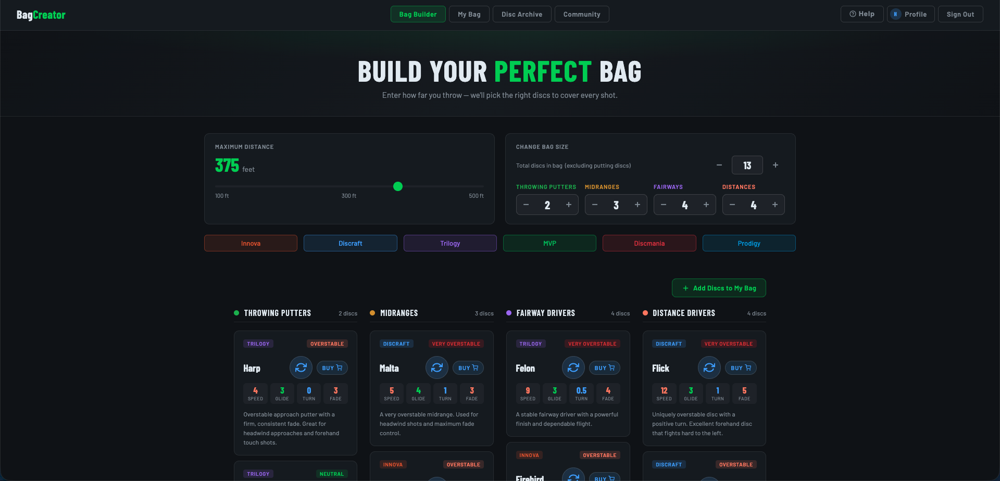

# 🥏 Bag Creator

A web app for designing, saving, and sharing custom disc golf bags. Pick a max throw distance and bag size, and the builder picks discs across putters, midranges, fairways, and distance drivers to cover every shot.



## Features

- **Bag Builder** — distance-based disc selection across throwing putters, midranges, fairway drivers, and distance drivers, filtered by manufacturer (Innova, Discraft, Trilogy, MVP, Discmania, Prodigy).
- **My Bag** — save, edit, and view your custom bag with disc flight numbers and descriptions.
- **Disc Archive** — browse the full disc catalog.
- **Community** — view other users' bags.
- **Auth + Profiles** — Supabase auth with a per-user profile page; users can only read and write their own bag data.

## Tech stack

- **HTML / CSS / JavaScript** — vanilla, no framework
- **Supabase** — Postgres for bag storage, Auth for accounts, Row-Level Security for per-user data isolation
- Multi-page architecture: `index.html`, `custom-bag.html`, `view-bag.html`, `archive.html`, `social.html`, `profile.html`, `login.html`

## Running locally

Open `index.html` in a browser, or serve the directory with any static server:

```bash
python3 -m http.server 8000
# then visit http://localhost:8000
```

Requires a `supabase-config.js` with a project URL and anon key.
